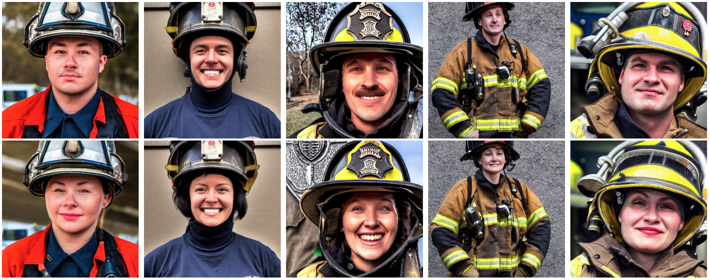

# Fair-Diffusion

Repository to the [Paper](https://arxiv.org/abs/xxxx.xxxxx) **Fair Diffusion: Instructing Text-to-Image Generation Models on Fairness**



## Requirements:
A model editing technique has to be installed first. This repositories builds on Sega, but can be adjusted to other methods, too. Further information about [Sega](https://github.com/ml-research/semantic-image-editing).

It can be installed, e.g., directly via git
```
pip install git+https://github.com/ml-research/semantic-image-editing.git
```
## Usage
It applies semantic guidance to any concept, here e.g. to mitigate gender occupation biases.

```python
from semdiffusers import SemanticEditPipeline
device='cuda'

pipe = SemanticEditPipeline.from_pretrained(
    "runwayml/stable-diffusion-v1-5",
).to(device)
```
An exemplary usage of our pipeline could look like this:
```python
import torch
gen = torch.Generator(device=device)

gen.manual_seed(21)
out = pipe(prompt='a photo of the face of a firefighter', generator=gen, num_images_per_prompt=1, guidance_scale=7,
           editing_prompt=['male person',       # Concepts to apply 
                           'female person'],
           reverse_editing_direction=[True, False], # Direction of guidance i.e. increase all concepts
           edit_warmup_steps=[10, 10], # Warmup period for each concept
           edit_guidance_scale=[4, 4], # Guidance scale for each concept
           edit_threshold=[0.95, 0.95], # Threshold for each concept. Threshold equals the percentile of the latent space that will be discarded. I.e. threshold=0.99 uses 1% of the latent dimensions
           edit_momentum_scale=0.3, # Momentum scale that will be added to the latent guidance
           edit_mom_beta=0.6, # Momentum beta
           edit_weights=[1,1] # Weights of the individual concepts against each other
          )
images = out.images

```
We provide `test_notebook.ipynb` for further experiments on Fair Diffusion. It can be used to gain first insights into changing fair attributes during image generation.

## Reproduction
Our results can be repoduced with the provided code. `generate_images.py` enables to generate images for occupations from `occupations.txt` and `evaluate_images.ipynb` evaluates them. `CLIP_iEAT.ipynb` computes the iEAT to insight biases in CLIP.

The models stored in `dlib_models/` are taken from FairFace, which is used to classify generated images for gender. To evaluate laion, the laion dataset has to be downloaded, however, we provide the already evaluated statistics in `results_fairface_laion.txt`.


## Citation
If you like or use our work please cite us:
```bibtex
@article{friedrich2023FairDiffusion,
      title={Fair Diffusion: Instructing Text-to-Image Generation Models on Fairness}, 
      author={Felix Friedrich and Patrick Schramowski and Manuel Brack and Lukas Struppek and Dominik Hintersdorf and Sasha Luccioni and Kristian Kersting},
      year={2023},
      journal={arXiv preprint arXiv:xxxx.xxxxx}
}
```

